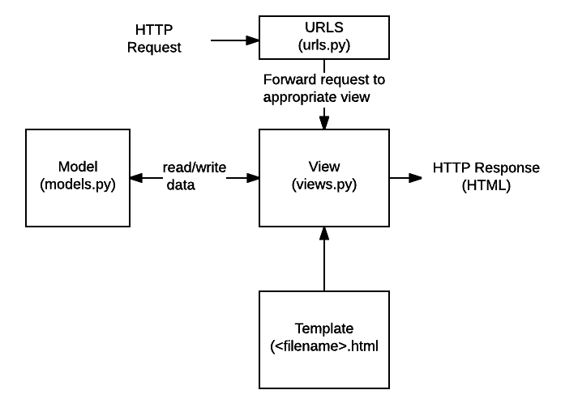
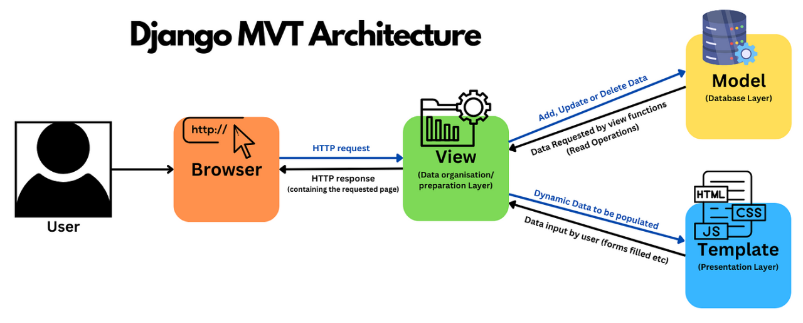
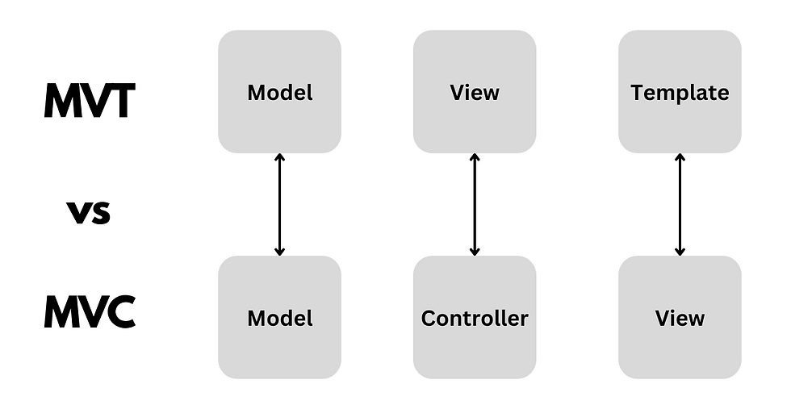

##### Modelo vista template

> https://developer.mozilla.org/en-US/docs/Learn/Server-side/Django/Introduction

> Direcciones URL: Si bien es posible procesar solicitudes de cada URL a través de una sola función, es mucho más fácil de mantener escribir una función de vista separada para manejar cada recurso. Un asignador de URL se utiliza para redirigir las solicitudes HTTP a la vista adecuada en función de la URL de la solicitud. El asignador de URL también puede coincidir con patrones particulares de cadenas o dígitos que aparecen en una URL y pasarlos a una función de vista como datos.

> Vista: Una vista es una función de controlador de solicitudes, que recibe solicitudes HTTP y devuelve respuestas HTTP. Las vistas acceden a los datos necesarios para satisfacer las solicitudes a través de modelos y delegan el formato de la respuesta a las plantillas.

> Modelos: Los modelos son objetos de Python que definen la estructura de los datos de una aplicación y proporcionan mecanismos para administrar (agregar, modificar, eliminar) y consultar registros en la base de datos.

> Plantillas: Una plantilla es un archivo de texto que define la estructura o el diseño de un archivo (como una página HTML), con marcadores de posición utilizados para representar el contenido real. Una vista puede crear dinámicamente una página HTML mediante una plantilla HTML, rellenándola con datos de un modelo. Una plantilla se puede utilizar para definir la estructura de cualquier tipo de archivo; ¡No tiene que ser HTML!

###### Diferencias entre MVC y MVT

